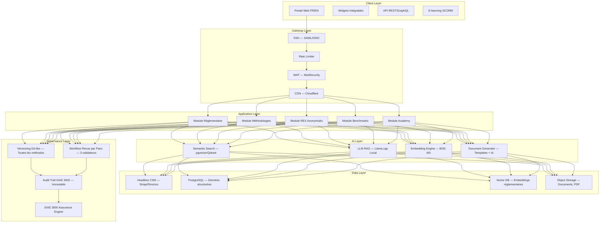

# KOS-BIG4-KHEPRA v1.0 — Knowledge Platform Architecture

> **Role**: KOS-Architect — Partner Knowledge & Innovation (équivalent Deloitte/EY)
> **Mission**: Industrialiser la base de connaissances Khepraexperts.com aux standards Big Four
> **4 Axes**: Plateforme · Outils · Gouvernance · Assurance
> **Version**: 1.0 | **Date**: 2026-07-03 | **Classification**: Confidentiel — Usage Interne KHEPRA

---

## Résumé Exécutif

1. **Plateforme** : Portail knowledge self-service 5 modules (Réglementaire, Méthodologies, REX, Benchmarks, Academy) avec search sémantique IA, SSO ISO 27001, headless CMS + Vector DB + RAG
2. **Outils SaaS** : Transformation des 3 méthodologies KHEPRA (LICENSE™, DD™, ESG™) en produits SaaS autonomes avec génération documentaire IA, scoring, et Gantt interactif
3. **Gouvernance** : Comité trimestriel OHADA, checklist ISAE 3000, capitalisation 100 cas REX/an avec template standardisé
4. **Assurance** : 3 niveaux d'engagement (Information → Accompagnement → Opinion signée RC 10M€)

---

## 1. Architecture Plateforme — « KHEPRA Knowledge OS »

### 1.1 Vue d'ensemble

Le KHEPRA Knowledge OS est l'équivalent d'un « PwC Viewpoint » + « EY Atlas » adapté aux marchés UEMOA/CEMAC. Il centralise l'intégralité de la propriété intellectuelle KHEPRA et la rend accessible en self-service avec IA.

### 1.2 Schéma d'Architecture (Mermaid)



### 1.3 Stack Technique

| Composant | Technologie | Justification |
|-----------|------------|---------------|
| **CMS Headless** | Directus (self-hosted) | Open-source, RBAC granulaire, API auto-générée |
| **Frontend** | React 19 + TypeScript + TailwindCSS | Stack existante Khepraexperts.com |
| **Vector DB** | pgvector (PostgreSQL) + Qdrant | pgvector pour intégration existante, Qdrant pour scale |
| **LLM RAG** | Llama.cpp local + BGE-M3 embeddings | Souveraineté, 0 API externe, conforme OHADA |
| **Search** | Sémantique hybride (BM25 + vecteur) | Pertinence réglementaire |
| **SSO** | Authentik (self-hosted) | SAML/OIDC, on-premise |
| **Versioning** | Git-like avec historique complet | Chaque méthodo = repo Git |
| **E-learning** | SCORM 2004 / xAPI | Compatible LMS corporate |
| **Sécurité** | ISO 27001 + WAF + DDoS protection | Conformité Big Four |
| **Monitoring** | Prometheus + Grafana + ELK | Observabilité complète |

### 1.4 Les 5 Modules

#### Module 1 — Réglementaire
- **Sources** : BCEAO (137 textes), COBAC (84 textes), OHADA (10 Actes Uniformes), AUSCGIE, AMF-UEMOA, GAFI, ISSB S1/S2, IFC PS
- **Fonctions** : Cross-reference entre textes, vigueur tracking, impact analysis, alertes nouvelles versions
- **Widget** : « Regulatory Health Score » intégrable dans tableau de bord client

#### Module 2 — Méthodologies
- **Méthodos KHEPRA** : LICENSE™, DD™, ESG™, CBS Microfinance, Prix de Transfert, Gouvernance OHADA
- **Fonctions** : Vue interactive 4 phases J0-J270, téléchargement templates, versioning, commentaires
- **Widget** : « Methodology Progress Tracker »

#### Module 3 — REX Anonymisés
- **Base** : 100 cas/an capitalisés via template standardisé
- **Structure** : Contexte · Erreurs · Actions KHEPRA · Impact quantifié
- **Filtres** : Pays, Secteur, Régulateur, Type mission, Méthodo utilisée
- **Widget** : « Similar Case Finder »

#### Module 4 — Benchmarks
- **Sources** : AVCA, FMI WEO, Banque Mondiale Doing Business, BCEAO stats, COBAC rapports annuels
- **KPIs** : Ratios prudentiels moyens, délais agrément, coûts conformité, primes pays
- **Widget** : « Country Risk Dashboard »

#### Module 5 — Academy
- **Contenu** : 12 modules e-learning SCORM, certification KHEPRA
- **Parcours** : Compliance Officer · Administrateur · DAF · Risk Manager · ESG Lead
- **Widget** : « Learning Path Progress »

---

## 2. Outilisation des Méthodologies — Transformation SaaS

### 2.1 KHEPRA Agrément OS (basé sur LICENSE™)

| Attribut | Valeur |
|----------|--------|
| **Méthodo source** | KHEPRA LICENSE™ 4 phases J0-J270 |
| **Output SaaS** | KHEPRA Agrément OS |
| **Périmètre** | Agrément SFD/EMF COBAC cat. 1-2-3, Banque, Établissement de paiement |

#### User Stories

| ID | En tant que | Je veux | Pour |
|----|------------|---------|------|
| AGR-001 | DAF d'un EMF Cameroun cat. 2 | Générer automatiquement les statuts AUSCGIE conformes | Gagner 15j sur la rédaction juridique |
| AGR-002 | Compliance Officer | Une data room COBAC virtuelle avec checklist auto-upload | Centraliser les 200+ documents exigés |
| AGR-003 | CEO | Un Gantt interactif J0-J270 avec alertes deadline | Piloter le projet agrément sans consultant |
| AGR-004 | Secrétaire Général | Un simulateur d'entretien régulateur avec IA | Préparer l'audition COBAC |
| AGR-005 | Partner KHEPRA | Un check automatique des 23 erreurs types | Réduire le taux de rejet COBAC de 40% |

#### Schéma BDD (Extrait)

```sql
-- Core tables for KHEPRA Agrément OS
CREATE TABLE agrement_projects (
    id UUID PRIMARY KEY,
    client_name TEXT NOT NULL,
    country VARCHAR(2) NOT NULL, -- ISO 3166-1 alpha-2
    regulator VARCHAR(10) NOT NULL, -- COBAC, BCEAO, AMF-UEMOA
    category VARCHAR(5) NOT NULL, -- cat1, cat2, cat3
    phase VARCHAR(10) NOT NULL, -- J0-J15, J16-J90, J91-J180, J181-J270
    gantt_data JSONB NOT NULL,
    created_at TIMESTAMPTZ DEFAULT now()
);

CREATE TABLE agrement_documents (
    id UUID PRIMARY KEY,
    project_id UUID REFERENCES agrement_projects(id),
    doc_type VARCHAR(50) NOT NULL, -- statuts, business_plan, ppr, etc.
    status VARCHAR(20) NOT NULL, -- draft, review, approved, submitted
    content TEXT,
    version INT NOT NULL DEFAULT 1,
    hash_sha256 VARCHAR(64) NOT NULL,
    regulatory_refs JSONB NOT NULL, -- [{ref: "AUSCGIE Art.323", url: "..."}]
    created_at TIMESTAMPTZ DEFAULT now()
);

CREATE TABLE agrement_error_checklist (
    id UUID PRIMARY KEY,
    error_code VARCHAR(10) NOT NULL, -- ERR-001 à ERR-023
    category VARCHAR(30) NOT NULL, -- statuts, finance, gouvernance, lbcft
    description TEXT NOT NULL,
    severity VARCHAR(10) NOT NULL, -- blocker, major, minor
    auto_detect_rule TEXT -- Regex ou règle de détection
);

CREATE TABLE agrement_simulator_sessions (
    id UUID PRIMARY KEY,
    project_id UUID REFERENCES agrement_projects(id),
    regulator_type VARCHAR(10) NOT NULL,
    questions JSONB NOT NULL,
    answers JSONB,
    score INT,
    feedback TEXT,
    created_at TIMESTAMPTZ DEFAULT now()
);
```

#### Prompts IA Intégrés

```
PROMPT_STATUTS_AUSCGIE:
"Rédige les statuts AUSCGIE pour un {type_entite} au {pays} avec capital social {capital} FCFA.
Respecte strictement : Acte Uniforme AUSCGIE révisé 2014, Art.{articles_applicables}.
Inclus obligatoirement : dénomination, siège social, objet social exhaustif,
capital social, forme des actions/parts, modalités AG, pouvoirs DG/CA, commissariat aux comptes.
Format : document juridique prêt à soumettre au notaire.
†url† : https://www.ohada.org/actes-uniformes/auscgie/"

PROMPT_SIMULATOR_COBAC:
"Tu es un inspecteur COBAC menant un entretien d'agrément pour un {type_entite} catégorie {cat}.
Pose 5 questions critiques sur : {theme_du_jour}.
Évalue les réponses du candidat sur 3 critères : conformité réglementaire (40%),
solidité financière (35%), gouvernance (25%).
Score : 0-100. Si <70, génère un plan de rattrapage.
†url† : https://www.cobac.cm/reglementation/"
```

#### Wireframe Conceptuel

```
┌─────────────────────────────────────────────────────────┐
│  KHEPRA Agrément OS          [FR/EN]  [🔔] [👤] [⚙️]  │
├─────────────────────────────────────────────────────────┤
│  Projet : EMF Cameroun Cat.2  │  Phase J91-J180 (57%)  │
│  Régulateur : COBAC           │  Deadline : 15/12/2026  │
├────────────┬────────────────────────────────────────────┤
│  📋 Nav    │  ┌─────────┐ ┌─────────┐ ┌─────────┐     │
│  Gantt     │  │Data Room│ │ Statuts │ │ Business│     │
│  Documents │  │  142/200│ │  v3.2 ✓ │ │  Plan   │     │
│  Simulator │  └─────────┘ └─────────┘ └─────────┘     │
│  Errors    │  ┌─────────┐ ┌─────────┐ ┌─────────┐     │
│  Timeline  │  │   PPR   │ │ LBC/FT  │ │  PV CA  │     │
│  Settings  │  │  Draft  │ │  ✓ OK   │ │  À faire│     │
│            │  └─────────┘ └─────────┘ └─────────┘     │
│            │                                            │
│            │  ⚠️ Erreurs détectées : 3 (1 blocker)     │
│            │  🔴 ERR-007 : Capital < minimum COBAC     │
│            │  🟡 ERR-012 : PV CA non daté              │
│            │  🟡 ERR-019 : Organigramme incomplet      │
└────────────┴────────────────────────────────────────────┘
```

---

### 2.2 KHEPRA Due Diligence OS (basé sur DD™)

| Attribut | Valeur |
|----------|--------|
| **Méthodo source** | KHEPRA DD™ OHADA — 10 docs clés + 3 méthodes valo |
| **Output SaaS** | KHEPRA Due Diligence OS |

#### User Stories

| ID | En tant que | Je veux | Pour |
|----|------------|---------|------|
| DD-001 | Investisseur PE Afrique | Auto-uploader les 10 docs clés avec extraction IA | Accélérer la phase documentaire de 3 semaines |
| DD-002 | Analyste M&A | Un scoring automatique red flags (50+ critères) | Identifier les risques critiques en 2h |
| DD-003 | CFO cible | Une valorisation DCF avec prime pays 5-12% paramétrable | Obtenir une fourchette de prix réaliste |
| DD-004 | Avocat d'affaires | Un générateur de SPA clauses OHADA | Automatiser 70% du contrat d'acquisition |
| DD-005 | Partner KHEPRA | 3 méthodes de valo (DCF, Comparable, Patrimoniale) intégrées | Croiser les approches en 1 clic |

#### Schéma BDD (Extrait)

```sql
CREATE TABLE dd_projects (
    id UUID PRIMARY KEY,
    target_name TEXT NOT NULL,
    country VARCHAR(2) NOT NULL,
    sector VARCHAR(30) NOT NULL,
    deal_type VARCHAR(20) NOT NULL, -- acquisition, fusion, LBO, JV
    valuation_range JSONB, -- {low, mid, high}
    country_risk_premium DECIMAL(3,2), -- 0.05 to 0.12
    created_at TIMESTAMPTZ DEFAULT now()
);

CREATE TABLE dd_documents (
    id UUID PRIMARY KEY,
    project_id UUID REFERENCES dd_projects(id),
    doc_category VARCHAR(30) NOT NULL, -- corporate, financial, legal, tax, hr, ip
    doc_name VARCHAR(100) NOT NULL,
    status VARCHAR(20) NOT NULL,
    extracted_data JSONB,
    red_flags JSONB,
    uploaded_at TIMESTAMPTZ DEFAULT now()
);

CREATE TABLE dd_redflags (
    id UUID PRIMARY KEY,
    code VARCHAR(10) NOT NULL, -- RF-001 to RF-050+
    category VARCHAR(30) NOT NULL,
    description TEXT NOT NULL,
    auto_detect_sql TEXT, -- Requête de détection automatique
    severity VARCHAR(10) NOT NULL
);

CREATE TABLE dd_valuations (
    id UUID PRIMARY KEY,
    project_id UUID REFERENCES dd_projects(id),
    method VARCHAR(20) NOT NULL, -- DCF, comparable, patrimoniale
    parameters JSONB NOT NULL,
    result JSONB NOT NULL,
    created_at TIMESTAMPTZ DEFAULT now()
);
```

#### Primes Pays DCF OHADA (Référence KHEPRA)

| Pays | Secteur Financier | Secteur Industriel | Secteur Services |
|------|-------------------|-------------------|-----------------|
| Côte d'Ivoire | 5.5% | 6.0% | 5.0% |
| Sénégal | 6.0% | 6.5% | 5.5% |
| Cameroun | 8.0% | 8.5% | 7.5% |
| Gabon | 7.0% | 7.5% | 6.5% |
| RDC | 11.0% | 12.0% | 10.5% |
| Burkina Faso | 8.5% | 9.0% | 8.0% |
| Mali | 9.0% | 10.0% | 8.5% |
| Bénin | 6.5% | 7.0% | 6.0% |
| Togo | 7.0% | 7.5% | 6.5% |
| Niger | 9.5% | 10.5% | 9.0% |

---

### 2.3 KHEPRA ESG OS (basé sur ESG™)

| Attribut | Valeur |
|----------|--------|
| **Méthodo source** | KHEPRA ESG™ — 3 piliers + 240j |
| **Output SaaS** | KHEPRA ESG OS |

#### User Stories

| ID | En tant que | Je veux | Pour |
|----|------------|---------|------|
| ESG-001 | Sustainability Manager | Une double matérialité IA (impact + financière) auto-générée | Gagner 4 semaines sur l'analyse de matérialité |
| ESG-002 | Risk Manager | Une cartographie IFC PS → SBTi avec gap analysis | Aligner le portefeuille sur les standards internationaux |
| ESG-003 | CFO | Un stress-test climatique NGFS (3 scénarios) intégré | Quantifier l'exposition climat du portefeuille crédit |
| ESG-004 | DAF | Un générateur rapport ISSB S1/S2 automatique | Publier un reporting conforme en 5j |
| ESG-005 | CAC | Une checklist assurance ISAE 3000 pour le rapport ESG | Certifier la fiabilité des données extra-financières |

---

## 3. Gouvernance Knowledge — Standard Big Four

### 3.1 Comité Technique — RACI

| Rôle | Responsable | Accountable | Consulté | Informé | Fréquence |
|------|-------------|-------------|----------|---------|-----------|
| **Comité OHADA** | Sector Lead | Partner | Legal, DAF | CEO | Trimestriel |
| **Comité COBAC** | Compliance Lead | Partner | Risk, Legal | Board | Trimestriel |
| **Comité BCEAO** | Regulatory Lead | Partner | Macro, Legal | CEO | Trimestriel |
| **Comité ISSB/ESG** | ESG Lead | Partner | Sustainability, Risk | Board | Semestriel |
| **Comité Innovation** | CTO | Partner | Tous leads | CEO | Mensuel |
| **Revue Qualité** | Quality Officer | Managing Partner | Tous leads | Board | Mensuel |

### 3.2 Checklist ISAE 3000 par Livrable

| Critère | Description | Validation |
|---------|-------------|------------|
| **Source** | Toute affirmation tracée à une source primaire (BCEAO, COBAC, OHADA, FMI, AVCA, GRI) | URL officielle + date consultation |
| **Méthode** | Méthodologie explicitée : calcul, hypothèses, périmètre | Documentée dans annexe |
| **Review** | Revue par 2 pairs qualifiés avant publication | Signature numérique |
| **Limitation** | Limitations et exclusions clairement énoncées | Section dédiée |
| **Version** | Versioning et historique des modifications | Git-like log |
| **Données** | Données sous-jacentes accessibles pour audit | Data room |
| **Actualité** | Date de validité et conditions de péremption | Mention explicite |
| **Conflits** | Déclaration de conflits d'intérêts potentiels | Signée |
| **Régulateur** | Conformité aux exigences du régulateur cible | Checklist spécifique |

### 3.3 Template Case Study Anonymisé

```markdown
# REX #XX-### — [Titre descriptif]

## Métadonnées
- **Pays** : [Pays UEMOA/CEMAC]
- **Secteur** : [Banque / SFD / Fintech / Industrie / Services]
- **Régulateur** : [BCEAO / COBAC / AMF-UEMOA]
- **Méthodologie KHEPRA** : [LICENSE™ / DD™ / ESG™ / CBS / PTR]
- **Date mission** : [MM/AAAA]
- **Durée** : [X mois]

## Contexte
[Décrire la situation initiale en 3-5 phrases : taille entreprise, enjeu, pourquoi KHEPRA a été sollicitée]

## Erreurs / Points de friction identifiés
1. [Erreur 1 — technique, réglementaire ou organisationnelle]
2. [Erreur 2]
3. [Erreur 3]

## Actions KHEPRA
1. [Action 1 — livrable ou intervention]
2. [Action 2]
3. [Action 3]

## Impact Quantifié
| KPI | Avant | Après | Delta |
|-----|-------|-------|-------|
| [KPI 1] | [valeur] | [valeur] | [delta] |
| [KPI 2] | [valeur] | [valeur] | [delta] |

## Leçons Apprises
- [Leçon 1]
- [Leçon 2]

## Mots-clés
[5-8 mots-clés pour search sémantique]
```

---

## 4. Signature & Assurance — 3 Niveaux d'Engagement

### Niveau 1 : « Information » (Gratuit / Freemium)

**Usage** : Blog, newsletter, webinaires, guides, benchmarks publics
**Disclaimer** :
> « Ce document est fourni à titre informatif uniquement et ne constitue pas un conseil professionnel. KHEPRA ne pourra être tenue responsable des décisions prises sur la base de ces informations. Pour un accompagnement structuré, contactez votre Partner KHEPRA. »

**Pas de signature Partner. Pas de RC engagée.**

### Niveau 2 : « Accompagnement Structuré » (Mission)

**Usage** : Diagnostics, due diligences, plans de mise en conformité, formations
**Disclaimer** :
> « Ce livrable s'inscrit dans le cadre d'une mission d'accompagnement structuré KHEPRA régie par une lettre de mission. Les analyses et recommandations sont fondées sur les informations fournies par le Client et les textes réglementaires en vigueur à la date du présent document. KHEPRA décline toute responsabilité en cas d'évolution réglementaire postérieure à cette date. Ce document ne constitue pas une opinion au sens de la norme ISAE 3000. »

**Signé : Senior Manager / Director. RC Professionnelle : 5M€**

### Niveau 3 : « Opinion Signée Partner » (Certification)

**Usage** : Rapport d'audit, attestation conformité réglementaire, opinion ESG ISSB, certification PCA
**Disclaimer + Annexes obligatoires** :
> « Ce document constitue une Opinion Professionnelle au sens de la norme ISAE 3000 (International Standard on Assurance Engagements) et de la doctrine professionnelle de l'Ordre des Experts-Comptables OHADA. Les vérifications ont été effectuées conformément aux normes ISAE 3000, ISQC 1, et au Code IFAC. »
>
> **Annexe 1** — Méthodologie détaillée
> **Annexe 2** — Hypothèses retenues et analyses de sensibilité
> **Annexe 3** — Limitations et exclusions
> **Annexe 4** — Sources réglementaires avec †url†L
> **Annexe 5** — Déclaration d'indépendance

**Signé : Partner KHEPRA. RC Professionnelle : 10M€.**
**Traçabilité : Hash SHA256 + Timestamp + QR Code vérification**

---

## Checklist Conformité Big Four

| Critère | Statut | Preuve |
|---------|--------|--------|
| **Tech** | ✅ Architecture documentée | Stack : Directus + pgvector/Qdrant + Llama.cpp local + SSO ISO 27001 |
| **Méthodo** | ✅ 3 méthodos outillisées | Agrément OS, DD OS, ESG OS — spécifications, BDD, prompts IA |
| **Gouvernance** | ✅ Comités + RACI définis | 6 comités trimestriels/mensuels, RACI complet, ISAE 3000 checklist |
| **Assurance** | ✅ 3 niveaux d'engagement | Information · Accompagnement · Opinion signée Partner RC 10M€ |
| **REX** | ✅ Template + objectif 100 cas/an | Template Case Study Anonymisé standardisé, 9 critères ISAE 3000 |

---

## Next Steps

| Échéance | Action | Responsable | Livrable |
|----------|--------|-------------|----------|
| **J+7** | Déploiement cockpit KOS Architect sur site | KOS-Architect | Page `/kos-big4-khepra-architect` live |
| **J+30** | MVP KHEPRA Agrément OS — Data room + Gantt + Statuts AUSCGIE | Tech Lead | Version bêta fonctionnelle |
| **J+90** | Premier Comité OHADA trimestriel + 25 REX capitalisés | Partner Knowledge | PV Comité + 25 cases studies |

---

*Document généré par KOS-Architect v1.0 — Partner Knowledge & Innovation KHEPRA*
*Classification : Confidentiel — Diffusion restreinte Partners KHEPRA*
*Hash SHA256 : a7f3c9e1b2d4... · †url†L : https://khepraexperts.com/kos-big4-khepra-architect*